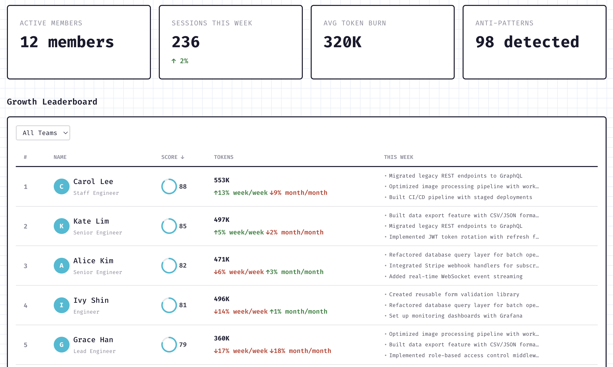
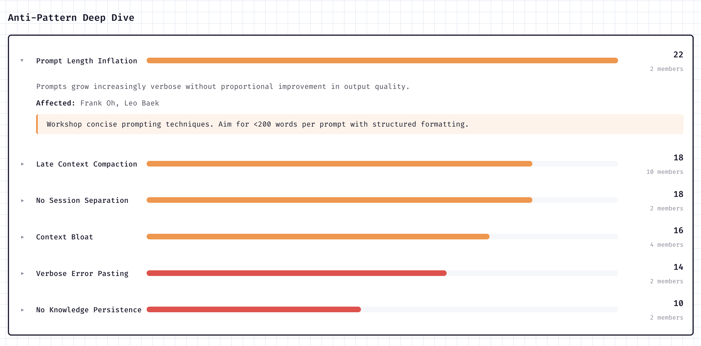
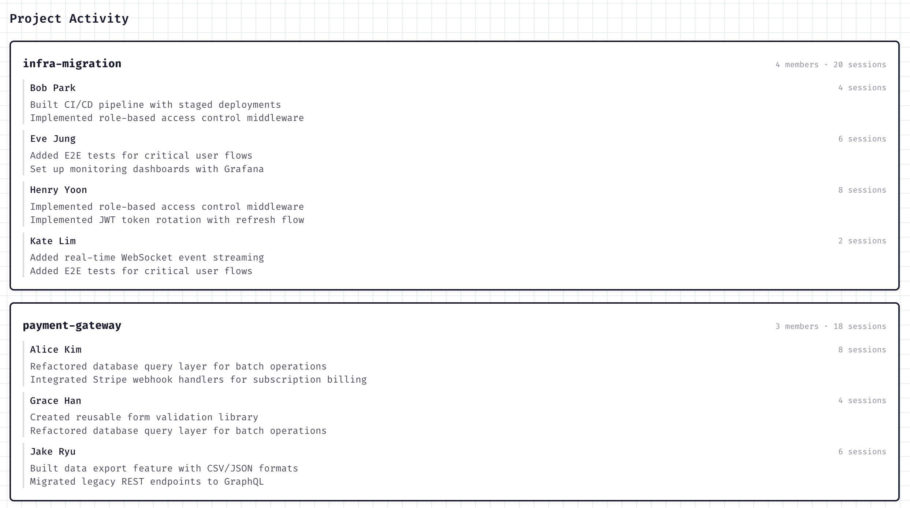

# BetterPrompt

> AI coding session analysis that runs entirely inside your AI coding tool. No API keys. No server. Just install the plugin and ask for your report.

[](https://opensource.org/licenses/MIT)
[](https://nodejs.org/)
[](https://www.typescriptlang.org/)

**How it works:** BetterPrompt is a Claude Code plugin. It scans your local session logs, extracts metrics deterministically, then uses Claude (the model you're already paying for) to analyze your collaboration patterns across 5 domains: thinking quality, communication, learning behavior, context efficiency, and session outcomes. Results are assembled into a canonical local run and served as a standalone HTML report on localhost.

No separate server. No Gemini API key. No data leaves your machine.

**Supported AI coding tools:**

| Tool | Session Source | Format |
|------|---------------|--------|
| Claude Code | `~/.claude/projects/` | JSONL |
| Cursor | `~/.cursor/chats/` and Cursor composer storage | SQLite |

## Screenshots

| Team Dashboard | Growth Areas | Project Breakdown |
|:-:|:-:|:-:|
|  |  |  |

## Quick Start (Plugin)

The recommended way to use BetterPrompt. Zero configuration required.

### 1. Install the plugin

In any Claude Code session, run:

```
/plugin marketplace add onlycastle/BetterPrompt
/plugin install betterprompt@betterprompt
```

That's it. The MCP server, analysis skills, and post-session hooks are registered automatically.

If `autoAnalyze` is enabled, BetterPrompt can queue an analysis at session end and inject startup context in the next Claude Code session so the queued run resumes automatically.

### 2. Run your analysis

In any Claude Code session, run:

```
/bp-analyze
```

The plugin orchestrates the full pipeline -- scan sessions, extract data, analyze each domain, classify your type, and serve a report at `http://localhost:3456`.

### Available Commands

| Command | Description |
|---------|-------------|
| `/bp-analyze` | Run the full analysis pipeline: scan, extract, analyze 5 domains, classify type, generate report |
| `/summarize-sessions` | Generate a concise 1-line summary for each analyzed session |
| `/summarize-projects` | Generate project-level summaries from session data |
| `/generate-weekly-insights` | Create a "This Week" narrative with stats and highlights |
| `/classify-type` | Classify your developer type into the 5x3 matrix with narrative |
| `/translate-report` | Translate report output for non-English sessions |

### Uninstalling

In any Claude Code session, run:

```
/plugin uninstall betterprompt@betterprompt
```

To also remove local analysis data (results, reports, caches):

```bash
rm -rf ~/.betterprompt
```

Optionally, clean up the marketplace registration:

```bash
rm -rf ~/.claude/plugins/cache/betterprompt
rm -rf ~/.claude/plugins/marketplaces/betterprompt
```

## Optional: Dashboard Server

If you want persistence, sharing, or enterprise dashboards, run the Next.js server alongside the plugin. Analysis itself still runs inside Claude Code; the server is for auth, storage, and dashboards.

```bash
git clone https://github.com/onlycastle/BetterPrompt.git
cd BetterPrompt
npm install
npm run dev
```

When you want a local plugin run stored on the server, use the plugin's `sync_to_team` MCP tool or `POST /api/analysis/sync`.
For a shared dashboard, set the plugin's `serverUrl` setting to your BetterPrompt server or pass `serverUrl` directly to `sync_to_team`.

## Team Manager Guide

For engineering managers who want to track team-wide AI collaboration patterns. Requires the web server, but team members still run analysis through the Claude Code plugin.

### 1. Set up your organization

Start the server (`npm run dev`), then navigate to `/dashboard/enterprise`. First-time admin users are guided through a 3-step setup wizard:

1. **Create organization** - set your org name (URL slug auto-generates)
2. **Create first team** - name your team (optional, can skip)
3. **Share server URL** - the wizard shows the dashboard URL for your team members

### 2. Invite team members

Go to `/dashboard/enterprise/members` and click **Invite Member**. Add members by email and assign a role:

| Role | Permissions |
|------|-------------|
| `owner` | Full access (org creator) |
| `admin` | Invite/edit/remove members, create/delete teams |
| `member` | View dashboards |
| `viewer` | Read-only access |

### 3. Team members run their analyses

Each team member needs:

1. The BetterPrompt Claude Code plugin installed
2. Your shared BetterPrompt server URL

After running a local analysis via the plugin, members use the plugin's `serverUrl` setting or pass `serverUrl` to `sync_to_team` to upload the canonical run to the shared dashboard.

### 4. Monitor your team

The enterprise dashboard at `/dashboard/enterprise` provides:

- **Overview** - active members, weekly sessions, token usage, anti-pattern counts
- **Growth Leaderboard** - members ranked by score improvement
- **Team Detail** (`/dashboard/enterprise/team/{teamId}`) - radar charts, type distribution, skill gaps
- **Member Detail** (`/dashboard/enterprise/members/{memberId}`) - individual score history, anti-patterns, project activity
- **KPT Retrospective** - aggregated Keep/Problem/Try patterns across the team
- **Settings** (`/dashboard/enterprise/settings`) - org info and server URL

## Plugin (`packages/plugin`)

Claude Code plugin with local-first analysis. Provides MCP tools for the full pipeline and analysis skills that guide Claude through each domain.

**MCP Tools (local-first, no server needed):**

| Tool | Description |
|------|-------------|
| `scan_sessions` | Discover and cache supported local session logs from Claude Code and Cursor |
| `extract_data` | Run deterministic Phase 1 extraction (metrics, scores) |
| `save_domain_results` | Store domain analysis results (called by analysis skills) |
| `classify_developer_type` | Classify into the 5x3 type matrix |
| `generate_report` | Generate HTML report and serve on localhost |
| `sync_to_team` | Optional: sync results to a team server |

**MCP Tools (server-backed, backward compatible):**

| Tool | Description |
|------|-------------|
| `get_developer_profile` | Profile type, scores, personality summary |
| `get_growth_areas` | Growth areas with optional domain filter |
| `get_recent_insights` | Strengths, anti-patterns, KPT retrospective |

**Analysis Skills** (`packages/plugin/skills/`): Markdown files containing PTCF analysis frameworks. Claude reads these as instructions and calls `save_domain_results` with structured findings. Domains: thinking quality, communication patterns, learning behavior, context efficiency, session outcomes, plus a content writer for narrative synthesis.

```bash
cd packages/plugin
npm run build
```

### Web Server (root)

Next.js app with the team dashboard UI, auth, persistence, and sync routes. Required only for team/enterprise features or the web-based dashboard.

```bash
npm run dev        # Dev server on port 3000
npm run build      # Production build
npm run typecheck  # Type-check without emitting
```

## Testing

Tests use [Vitest](https://vitest.dev/) for unit/integration and [Playwright](https://playwright.dev/) for E2E.

```bash
npm test                # Unit tests
npm run test:watch      # Watch mode
npm run test:coverage   # Coverage report (threshold: 50%)
npm run test:integration # Full pipeline integration test
```

E2E tests (requires dev server or auto-starts one):

```bash
npx playwright test --config tests/e2e/playwright.config.ts
```

Test structure:

```
tests/
  unit/              # Models, parser, plugin parity, search agent
  e2e/               # Playwright browser tests (report rendering, scroll nav)
  integration.test.ts # Full pipeline: session parsing -> multi-phase analysis
  fixtures/          # Real session logs and evaluation data
```

## Project Structure

```
packages/
  plugin/                   Claude Code plugin (primary interface)
    mcp/                    MCP server + tool implementations
      tools/                Individual MCP tool modules
    skills/                 Analysis skill files (markdown)
    lib/
      core/                 Standalone extraction, scoring, type mapping
      report-template.ts    HTML report generator
      results-db.ts         Local SQLite storage
    hooks/                  Post-session analysis trigger
app/                        Next.js app router (team dashboard)
src/
  components/               React components
    dashboard/              Dashboard layout and navigation
    enterprise/             Team and org-level views
    landing/                Landing page sections
    personal/               Individual report tabs and insights
    report/                 Shared report UI
    ui/                     Reusable UI primitives
  lib/
    transformers/            Data transformation utilities
    domain/                 Domain models (config, knowledge, user, sharing)
    enterprise/             Team aggregation and enterprise features
    local/                  SQLite persistence (auth, reports, teams)
    models/                 Zod schemas and TypeScript types
    parser/                 JSONL session log parser
    search-agent/           Knowledge search and curation engine
  views/                    Page-level view components
tests/                      Unit, integration, and E2E test suites
docs/                       Architecture and deployment documentation
```

## Documentation

- [Architecture](./docs/human/ARCHITECTURE.md) - system design and pipeline overview
- [Plugin](./docs/human/PLUGIN.md) - plugin setup and MCP tools
- [User Flows](./docs/human/USER-FLOWS.md) - employee and manager workflows
- [Contributing](./CONTRIBUTING.md)

## License

MIT - see [LICENSE](./LICENSE).
