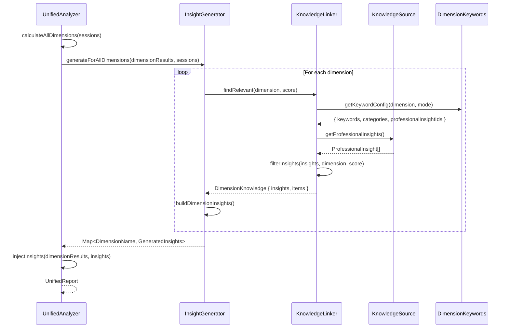

# Knowledge Base Architecture

이 문서는 NoMoreAISlop의 Knowledge Base (KB) 시스템 아키텍처와 Professional Insights가 분석 리포트에 통합되는 흐름을 설명합니다.

## Overview

Knowledge Base는 개발자의 AI 활용 분석 결과에 따라 **맞춤형 인사이트와 학습 리소스**를 제공합니다. 분석 차원(dimension)의 점수에 따라 강점 강화(reinforcement) 또는 개선(improvement) 인사이트가 선택됩니다.

## Architecture Diagram

```
┌─────────────────────────────────────────────────────────────────────────────┐
│                          Knowledge Base System                               │
├─────────────────────────────────────────────────────────────────────────────┤
│                                                                              │
│  ┌──────────────────────────────────────────────────────────────────────┐   │
│  │                     DATA SOURCES (Storage)                            │   │
│  │                                                                       │   │
│  │  ┌─────────────────────┐    ┌─────────────────────────────────────┐  │   │
│  │  │   knowledge.ts      │    │    Supabase (future)                │  │   │
│  │  │   INITIAL_INSIGHTS  │    │    knowledge_items table            │  │   │
│  │  │   (Primary Source)  │    │    professional_insights table      │  │   │
│  │  │   29 insights       │    │    (planned)                        │  │   │
│  │  └─────────────────────┘    └─────────────────────────────────────┘  │   │
│  │              │                                                        │   │
│  │              ▼                                                        │   │
│  │  ┌─────────────────────────────────────────────────────────────────┐ │   │
│  │  │              FALLBACK ARRAYS (Runtime)                          │ │   │
│  │  │                                                                  │ │   │
│  │  │  knowledge-linker.ts          supabase-knowledge-source.ts      │ │   │
│  │  │  INITIAL_PROFESSIONAL_        FALLBACK_PROFESSIONAL_            │ │   │
│  │  │  INSIGHTS (13 items)          INSIGHTS (13 items)               │ │   │
│  │  │  IDs: pi-001 ~ pi-016         IDs: pi-001 ~ pi-016              │ │   │
│  │  └─────────────────────────────────────────────────────────────────┘ │   │
│  └──────────────────────────────────────────────────────────────────────┘   │
│                                      │                                       │
│                                      ▼                                       │
│  ┌──────────────────────────────────────────────────────────────────────┐   │
│  │                     KNOWLEDGE SOURCE (Adapter)                        │   │
│  │                                                                       │   │
│  │  ┌─────────────────────┐    ┌─────────────────────────────────────┐  │   │
│  │  │  MockKnowledgeSource│    │    SupabaseKnowledgeSource          │  │   │
│  │  │  (Development)      │    │    (Production)                     │  │   │
│  │  │                     │    │                                     │  │   │
│  │  │  getProfessional    │    │    getProfessionalInsights()        │  │   │
│  │  │  Insights()         │    │    → Returns FALLBACK_*             │  │   │
│  │  │  → Returns INITIAL_ │    │    (until Supabase table exists)    │  │   │
│  │  │    PROFESSIONAL_*   │    │                                     │  │   │
│  │  └─────────────────────┘    └─────────────────────────────────────┘  │   │
│  └──────────────────────────────────────────────────────────────────────┘   │
│                                      │                                       │
│                                      ▼                                       │
│  ┌──────────────────────────────────────────────────────────────────────┐   │
│  │                      KNOWLEDGE LINKER                                 │   │
│  │                                                                       │   │
│  │  findRelevant(dimension, score)                                      │   │
│  │    1. Get keyword config from dimension-keywords.ts                  │   │
│  │    2. Fetch professional insights from source                        │   │
│  │    3. Filter by:                                                     │   │
│  │       - applicableDimensions (must include current dimension)        │   │
│  │       - minScore / maxScore (user's score must be in range)          │   │
│  │       - enabled flag                                                 │   │
│  │    4. Sort by priority and preference                                │   │
│  │    5. Return top 3 insights                                          │   │
│  └──────────────────────────────────────────────────────────────────────┘   │
│                                      │                                       │
│                                      ▼                                       │
│  ┌──────────────────────────────────────────────────────────────────────┐   │
│  │                      INSIGHT GENERATOR                                │   │
│  │                                                                       │   │
│  │  buildDimensionInsights(dimension, score, quotes, knowledge)         │   │
│  │    1. ConversationInsight (from user's actual quotes)                │   │
│  │    2. ResearchInsight (from professional insights)                   │   │
│  │    3. LearningResource (from knowledge items)                        │   │
│  └──────────────────────────────────────────────────────────────────────┘   │
│                                      │                                       │
│                                      ▼                                       │
│  ┌──────────────────────────────────────────────────────────────────────┐   │
│  │                      UNIFIED REPORT                                   │   │
│  │                                                                       │   │
│  │  dimensions[].insights[]                                             │   │
│  │    - type: 'reinforcement' | 'improvement'                           │   │
│  │    - conversationBased: { quote, advice, sentiment }                 │   │
│  │    - researchBased: { source, insight, url }                         │   │
│  │    - learningResource: { title, url, level }                         │   │
│  └──────────────────────────────────────────────────────────────────────┘   │
└─────────────────────────────────────────────────────────────────────────────┘
```

## Data Flow Sequence



## Key Components

### 1. Data Sources

| File | Purpose | 사용 시점 |
|------|---------|----------|
| `knowledge.ts` | Primary source of truth (INITIAL_INSIGHTS) | Documentation & future Supabase migration |
| `knowledge-linker.ts` | Runtime fallback (INITIAL_PROFESSIONAL_INSIGHTS) | MockKnowledgeSource (dev/test) |
| `supabase-knowledge-source.ts` | Runtime fallback (FALLBACK_PROFESSIONAL_INSIGHTS) | SupabaseKnowledgeSource (production) |
| `dimension-keywords.ts` | Dimension → Insight ID mapping | All environments |

### 2. Professional Insight Schema

```typescript
interface ProfessionalInsight {
  id: string;                      // e.g., 'pi-011'
  title: string;                   // 짧은 제목
  keyTakeaway: string;             // 핵심 메시지
  actionableAdvice: string[];      // 실행 가능한 조언 (1-5개)
  source: {
    type: 'arxiv' | 'blog' | 'official' | 'research' | 'x-post';
    author: string;
    url?: string;
  };

  // Filtering criteria
  applicableDimensions?: string[]; // 적용 대상 차원
  minScore?: number;               // 최소 점수 (이상일 때만 표시)
  maxScore?: number;               // 최대 점수 (이하일 때만 표시)

  priority: number;                // 1-10 (높을수록 먼저 표시)
  enabled: boolean;                // 활성화 여부
}
```

### 3. Filtering Logic

```
Score >= 70 → mode = 'reinforcement' (강점 강화)
Score < 70  → mode = 'improvement' (개선 필요)

Insight Selection:
  1. enabled === true
  2. applicableDimensions includes current dimension (or empty = all)
  3. score >= minScore (if defined)
  4. score <= maxScore (if defined)
  5. Sort by priority (descending)
  6. Take top 3
```

## Adding New Insights

### Step 1: Add to Primary Source (`knowledge.ts`)

```typescript
// src/lib/domain/models/knowledge.ts
export const INITIAL_INSIGHTS = [
  // ... existing insights ...
  {
    version: '1.0.0',
    category: 'tool',
    title: 'Your New Insight Title',
    keyTakeaway: 'The key message users should remember.',
    actionableAdvice: [
      'First actionable step',
      'Second actionable step',
      'Third actionable step',
    ],
    source: {
      type: 'blog',
      url: 'https://source-url.com',
      author: 'Author Name',
    },
    applicableDimensions: ['contextEngineering', 'toolMastery'],
    maxScore: 60,  // Only show for users scoring 60 or below
    priority: 8,
    enabled: true,
  },
];
```

### Step 2: Add to Fallback Arrays

If the insight should appear at runtime, add it with an explicit ID to both:

**knowledge-linker.ts:**
```typescript
const INITIAL_PROFESSIONAL_INSIGHTS = [
  // ... existing ...
  {
    id: 'pi-017',  // Next available ID
    title: 'Your New Insight Title',
    // ... same fields as above ...
  },
];
```

**supabase-knowledge-source.ts:**
```typescript
const FALLBACK_PROFESSIONAL_INSIGHTS = [
  // ... same as knowledge-linker.ts ...
];
```

### Step 3: Update Dimension Keywords (Optional)

If you want to prioritize this insight for specific dimensions:

```typescript
// dimension-keywords.ts
contextEngineering: {
  improvement: {
    professionalInsightIds: ['pi-006', 'pi-010', 'pi-017'],  // Add new ID
    // ...
  },
},
```

### Step 4: Verify

```bash
npm run typecheck
npm test
```

## Current Insights (as of 2025-01)

### Core Insights (pi-001 ~ pi-010)

| ID | Title | Dimensions |
|----|-------|------------|
| pi-001 | Skill Atrophy Self-Diagnosis | skillResilience |
| pi-002 | The 50% Modification Test | aiControl |
| pi-003 | The 80% Planning Rule | aiCollaboration, contextEngineering |
| pi-006 | Anthropic Context Engineering Techniques | contextEngineering, toolMastery |
| pi-007 | For Architects: Validate Against Your Plans | aiControl |
| pi-009 | AI Dependency Checklist | skillResilience, burnoutRisk |
| pi-010 | From Vibe Coding to Context Engineering | contextEngineering |

### Claude Code Best Practices (pi-011 ~ pi-016)

| ID | Title | Dimensions | Score Range |
|----|-------|------------|-------------|
| pi-011 | Fresh Sessions Outperform Continued Context | contextEngineering, iterationEfficiency | maxScore: 60 |
| pi-012 | Task Decomposition: A→A1→A2→A3→B Pattern | scopeManagement, aiCollaboration | all |
| pi-013 | The Write-Test-Verify Cycle | aiControl, skillResilience | all |
| pi-014 | Simple Agents Beat Complex Ones | aiCollaboration, toolMastery | minScore: 60 |
| pi-015 | Treat Context Like Memory Allocation | contextEngineering | maxScore: 70 |
| pi-016 | Reduce System Prompt to Recover 10k+ Tokens | contextEngineering, toolMastery | minScore: 70 |

## File Locations

```
src/lib/
├── domain/models/
│   └── knowledge.ts              # INITIAL_INSIGHTS (primary source)
├── analyzer/
│   ├── knowledge-linker.ts       # KnowledgeLinker + INITIAL_PROFESSIONAL_INSIGHTS
│   ├── supabase-knowledge-source.ts  # SupabaseKnowledgeSource + FALLBACK_*
│   ├── dimension-keywords.ts     # Dimension → Insight ID mapping
│   ├── insight-generator.ts      # InsightGenerator (builds final insights)
│   └── unified-analyzer.ts       # UnifiedAnalyzer (orchestrates analysis)
```

## Future Improvements

1. **Database Migration**: `professional_insights` Supabase 테이블 생성하여 런타임에 Supabase에서 직접 조회
2. **Deduplication**: `knowledge.ts`에서 fallback 배열을 import하여 중복 제거
3. **Admin UI**: Supabase Studio 또는 커스텀 UI로 인사이트 관리
4. **A/B Testing**: 인사이트 효과 측정을 위한 실험 프레임워크
5. **RAG Integration**: 의미 기반 검색으로 더 정확한 인사이트 매칭 (아래 섹션 참조)

---

## RAG (Retrieval Augmented Generation) 활용 계획

### Why RAG?

현재 시스템의 한계:

| 현재 방식 | 문제점 |
|-----------|--------|
| `applicableDimensions` 필터링 | 하드코딩된 매핑, 새 차원 추가 시 모든 인사이트 수정 필요 |
| `professionalInsightIds` 지정 | 수동 매핑, 확장성 제한 |
| Keyword 기반 검색 | 의미적 유사성 무시, 동의어/유사 개념 매칭 실패 |

RAG 도입 시 장점:

| RAG 방식 | 이점 |
|----------|------|
| Semantic Search | 사용자 대화 내용과 **의미적으로 유사한** 인사이트 자동 매칭 |
| Dynamic Retrieval | 하드코딩 없이 관련 콘텐츠 동적 검색 |
| Scalability | 인사이트 100개 → 10,000개로 확장해도 성능 유지 |
| Context-Aware | 사용자의 실제 문제 상황에 맞는 조언 제공 |

### RAG Architecture (Future State)

```
┌─────────────────────────────────────────────────────────────────────────────┐
│                        RAG-Enhanced Knowledge Base                          │
├─────────────────────────────────────────────────────────────────────────────┤
│                                                                             │
│  ┌─────────────────────────────────────────────────────────────────────┐   │
│  │                     INGESTION PIPELINE                               │   │
│  │                                                                      │   │
│  │  ┌─────────────┐    ┌─────────────┐    ┌─────────────────────────┐  │   │
│  │  │ Knowledge   │    │  Chunking   │    │    Embedding Model      │  │   │
│  │  │ Sources     │───▶│  Strategy   │───▶│    (text-embedding-3)   │  │   │
│  │  │             │    │             │    │                         │  │   │
│  │  │ • Insights  │    │ • By field  │    │    title + keyTakeaway  │  │   │
│  │  │ • Articles  │    │ • Metadata  │    │    + actionableAdvice   │  │   │
│  │  │ • Tutorials │    │   preserved │    │    → 1536-dim vector    │  │   │
│  │  └─────────────┘    └─────────────┘    └─────────────────────────┘  │   │
│  │                                                 │                    │   │
│  │                                                 ▼                    │   │
│  │                          ┌───────────────────────────────────────┐  │   │
│  │                          │         Vector Database               │  │   │
│  │                          │                                       │  │   │
│  │                          │  Option A: Supabase pgvector          │  │   │
│  │                          │  Option B: Pinecone                   │  │   │
│  │                          │  Option C: Qdrant (self-hosted)       │  │   │
│  │                          │                                       │  │   │
│  │                          │  Stores: vector + metadata (dim, score│  │   │
│  │                          │          range, priority, source)     │  │   │
│  │                          └───────────────────────────────────────┘  │   │
│  └─────────────────────────────────────────────────────────────────────┘   │
│                                         │                                   │
│                                         ▼                                   │
│  ┌─────────────────────────────────────────────────────────────────────┐   │
│  │                     RETRIEVAL PIPELINE                               │   │
│  │                                                                      │   │
│  │  ┌─────────────────────────────────────────────────────────────┐    │   │
│  │  │  Query Construction                                          │    │   │
│  │  │                                                              │    │   │
│  │  │  Input: dimension_name + user_quotes + analysis_summary      │    │   │
│  │  │                                                              │    │   │
│  │  │  Example Query:                                              │    │   │
│  │  │  "contextEngineering: User struggles with long sessions,     │    │   │
│  │  │   context window >70%, asks same questions repeatedly"       │    │   │
│  │  └─────────────────────────────────────────────────────────────┘    │   │
│  │                              │                                       │   │
│  │                              ▼                                       │   │
│  │  ┌─────────────────────────────────────────────────────────────┐    │   │
│  │  │  Hybrid Search                                               │    │   │
│  │  │                                                              │    │   │
│  │  │  1. Semantic Search (vector similarity)                      │    │   │
│  │  │     → Top 10 by cosine similarity                            │    │   │
│  │  │                                                              │    │   │
│  │  │  2. Metadata Filtering (current logic preserved)             │    │   │
│  │  │     → Filter by minScore/maxScore, enabled                   │    │   │
│  │  │                                                              │    │   │
│  │  │  3. Re-ranking (optional)                                    │    │   │
│  │  │     → Cohere Rerank or cross-encoder                         │    │   │
│  │  └─────────────────────────────────────────────────────────────┘    │   │
│  │                              │                                       │   │
│  │                              ▼                                       │   │
│  │  ┌─────────────────────────────────────────────────────────────┐    │   │
│  │  │  Return top 3 insights (same as current)                     │    │   │
│  │  └─────────────────────────────────────────────────────────────┘    │   │
│  └─────────────────────────────────────────────────────────────────────┘   │
└─────────────────────────────────────────────────────────────────────────────┘
```

### Implementation Phases

#### Phase 1: Vector Database Setup (Supabase pgvector)

Supabase는 이미 사용 중이므로 **pgvector extension**을 활용하는 것이 가장 효율적입니다.

```sql
-- Enable pgvector extension
CREATE EXTENSION IF NOT EXISTS vector;

-- Create table with vector column
CREATE TABLE professional_insights_vectors (
  id TEXT PRIMARY KEY,
  title TEXT NOT NULL,
  key_takeaway TEXT NOT NULL,
  actionable_advice TEXT[] NOT NULL,
  source_type TEXT NOT NULL,
  source_author TEXT NOT NULL,
  source_url TEXT,

  -- Filtering metadata (preserved from current logic)
  applicable_dimensions TEXT[],
  min_score INTEGER,
  max_score INTEGER,
  priority INTEGER NOT NULL,
  enabled BOOLEAN DEFAULT true,

  -- Vector embedding (OpenAI text-embedding-3-small: 1536 dims)
  embedding vector(1536),

  created_at TIMESTAMPTZ DEFAULT NOW(),
  updated_at TIMESTAMPTZ DEFAULT NOW()
);

-- Create index for fast similarity search
CREATE INDEX ON professional_insights_vectors
USING ivfflat (embedding vector_cosine_ops)
WITH (lists = 100);
```

#### Phase 2: Embedding Generation

```typescript
// src/lib/analyzer/embedding-service.ts

import OpenAI from 'openai';

const openai = new OpenAI();

interface InsightEmbeddingInput {
  title: string;
  keyTakeaway: string;
  actionableAdvice: string[];
}

/**
 * Generate embedding for a professional insight
 * Combines title + keyTakeaway + advice into single searchable text
 */
export async function generateInsightEmbedding(
  insight: InsightEmbeddingInput
): Promise<number[]> {
  const textToEmbed = [
    insight.title,
    insight.keyTakeaway,
    ...insight.actionableAdvice,
  ].join(' ');

  const response = await openai.embeddings.create({
    model: 'text-embedding-3-small',
    input: textToEmbed,
  });

  return response.data[0].embedding;
}

/**
 * Generate query embedding from user's analysis context
 */
export async function generateQueryEmbedding(
  dimension: string,
  userQuotes: string[],
  analysisSummary: string
): Promise<number[]> {
  const queryText = [
    `Dimension: ${dimension}`,
    `User behavior: ${userQuotes.slice(0, 3).join('; ')}`,
    `Analysis: ${analysisSummary}`,
  ].join(' ');

  const response = await openai.embeddings.create({
    model: 'text-embedding-3-small',
    input: queryText,
  });

  return response.data[0].embedding;
}
```

#### Phase 3: RAG-Enhanced KnowledgeLinker

```typescript
// src/lib/analyzer/rag-knowledge-linker.ts

interface RAGSearchOptions {
  dimension: DimensionName;
  score: number;
  userQuotes: string[];
  analysisSummary: string;
  limit?: number;
}

export class RAGKnowledgeLinker {
  constructor(
    private supabase: SupabaseClient,
    private embeddingService: EmbeddingService
  ) {}

  async findRelevant(options: RAGSearchOptions): Promise<ProfessionalInsight[]> {
    const { dimension, score, userQuotes, analysisSummary, limit = 3 } = options;

    // 1. Generate query embedding
    const queryEmbedding = await this.embeddingService.generateQueryEmbedding(
      dimension,
      userQuotes,
      analysisSummary
    );

    // 2. Hybrid search: vector similarity + metadata filtering
    const { data: insights } = await this.supabase.rpc(
      'search_insights_hybrid',
      {
        query_embedding: queryEmbedding,
        match_threshold: 0.7,
        match_count: limit * 2, // Fetch more for filtering
        filter_dimension: dimension,
        filter_score: score,
      }
    );

    // 3. Apply current filtering logic (minScore/maxScore)
    const filtered = insights.filter((insight) => {
      if (!insight.enabled) return false;
      if (insight.min_score && score < insight.min_score) return false;
      if (insight.max_score && score > insight.max_score) return false;
      return true;
    });

    // 4. Return top N
    return filtered.slice(0, limit);
  }
}
```

```sql
-- Supabase RPC function for hybrid search
CREATE OR REPLACE FUNCTION search_insights_hybrid(
  query_embedding vector(1536),
  match_threshold float,
  match_count int,
  filter_dimension text,
  filter_score int
)
RETURNS TABLE (
  id text,
  title text,
  key_takeaway text,
  actionable_advice text[],
  source_type text,
  source_author text,
  source_url text,
  min_score int,
  max_score int,
  priority int,
  enabled boolean,
  similarity float
)
LANGUAGE plpgsql
AS $$
BEGIN
  RETURN QUERY
  SELECT
    p.id,
    p.title,
    p.key_takeaway,
    p.actionable_advice,
    p.source_type,
    p.source_author,
    p.source_url,
    p.min_score,
    p.max_score,
    p.priority,
    p.enabled,
    1 - (p.embedding <=> query_embedding) as similarity
  FROM professional_insights_vectors p
  WHERE
    p.enabled = true
    AND (p.applicable_dimensions IS NULL OR filter_dimension = ANY(p.applicable_dimensions))
    AND 1 - (p.embedding <=> query_embedding) > match_threshold
  ORDER BY
    p.embedding <=> query_embedding,
    p.priority DESC
  LIMIT match_count;
END;
$$;
```

### Use Cases for RAG

| Use Case | 현재 방식 | RAG 방식 |
|----------|-----------|----------|
| **새 인사이트 추가** | `applicableDimensions` 수동 지정 | 자동으로 관련 검색어와 매칭 |
| **사용자 맥락 반영** | dimension + score만 고려 | 실제 대화 내용 기반 검색 |
| **유사 문제 매칭** | Keyword 일치 필요 | "context exhaustion" ≈ "컨텍스트 고갈" 자동 매칭 |
| **다국어 지원** | 언어별 키워드 필요 | Embedding이 의미 기반으로 매칭 |
| **롱테일 콘텐츠** | 상위 N개만 노출 | 관련성 높은 콘텐츠 동적 발굴 |

### RAG Query Examples

```typescript
// Example 1: Context Engineering improvement needed
const query1 = {
  dimension: 'contextEngineering',
  userQuotes: [
    'Why is Claude ignoring my instructions?',
    'I keep getting the same error over and over',
    'The conversation is too long now',
  ],
  analysisSummary: 'User shows signs of context exhaustion with repetitive errors',
};
// → Matches: pi-011 (Fresh Sessions), pi-015 (Treat Context Like Memory)

// Example 2: Skill Resilience reinforcement
const query2 = {
  dimension: 'skillResilience',
  userQuotes: [
    'Let me verify this approach before implementing',
    'I\'ll write the test first',
    'Can you explain why this works?',
  ],
  analysisSummary: 'User demonstrates strong verification habits and learning mindset',
};
// → Matches: pi-013 (Write-Test-Verify), pi-001 (Skill Atrophy Self-Diagnosis)
```

### Migration Strategy

```
Phase 1 (Week 1-2): Database Setup
├── Enable pgvector in Supabase
├── Create professional_insights_vectors table
├── Migrate existing FALLBACK_PROFESSIONAL_INSIGHTS
└── Generate embeddings for all insights

Phase 2 (Week 3-4): RAG Integration
├── Implement EmbeddingService
├── Create RAGKnowledgeLinker
├── Add Supabase RPC function
└── Feature flag for A/B testing

Phase 3 (Week 5-6): Validation & Rollout
├── Compare RAG vs rule-based results
├── Collect user feedback
├── Tune similarity threshold
└── Gradual rollout (10% → 50% → 100%)

Phase 4 (Ongoing): Content Expansion
├── Add more professional insights
├── Integrate external knowledge sources
├── Fine-tune embedding model (optional)
└── Implement re-ranking with Cohere
```

### Cost Considerations

| Component | Cost | Notes |
|-----------|------|-------|
| **text-embedding-3-small** | $0.02/1M tokens | ~1 cent per 1000 insights embedded |
| **Supabase pgvector** | Included in Pro plan | No additional cost |
| **Query embeddings** | ~$0.00002/query | Negligible for typical usage |
| **Cohere Rerank (optional)** | $1/1000 queries | Only if re-ranking needed |

총 예상 비용: 분석당 **< $0.001** (임베딩 쿼리 비용)

## Troubleshooting

### Insight가 리포트에 나타나지 않음

1. `enabled: true` 확인
2. `applicableDimensions`에 해당 차원이 포함되어 있는지 확인
3. 사용자의 점수가 `minScore`/`maxScore` 범위 내인지 확인
4. Fallback 배열에 추가되어 있는지 확인 (INITIAL_INSIGHTS만 있으면 런타임에서 사용 안 됨)

### TypeCheck 실패

```bash
npm run typecheck
```

- `version: '1.0.0'` 필수
- `source.type`은 `'arxiv' | 'blog' | 'official' | 'research' | 'x-post'` 중 하나
- `priority`는 1-10 사이
