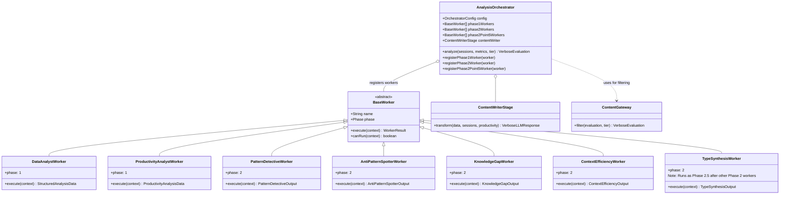

# Analysis Pipeline Class Diagram

> ⚠️ **DEPRECATED**: This document has been superseded by [LLM_FLOW.md](./LLM_FLOW.md).
>
> The original Module B (PersonalityAnalyst) has been removed.
> See LLM_FLOW.md for the current Orchestrator + Workers architecture.

## Current Architecture (2025-01)

> **UPDATE (2026-01)**: Phase 2.5 (TypeSynthesis) added for agent-informed classification refinement.



## Phase Execution Flow

```
Phase 1 (Parallel)
├── DataAnalystWorker (Module A) ──→ StructuredAnalysisData
├── ProductivityAnalystWorker (Module C) ──→ ProductivityAnalysisData
└── MultitaskingAnalyzerWorker ──→ MultitaskingAnalysisData
         │
         ▼
Phase 2 (Parallel, Premium+ only)
├── PatternDetectiveWorker ──→ PatternDetectiveOutput
├── AntiPatternSpotterWorker ──→ AntiPatternSpotterOutput
├── KnowledgeGapWorker ──→ KnowledgeGapOutput
├── ContextEfficiencyWorker ──→ ContextEfficiencyOutput
├── MetacognitionWorker ──→ MetacognitionOutput
└── TemporalAnalyzerWorker ──→ TemporalAnalysisOutput
         │
         ▼ (merged into AgentOutputs)

Phase 2.5 (NEW - Agent-Informed Classification)
└── TypeSynthesisWorker ──→ TypeSynthesisOutput
    - Refines initial type classification using all agent insights
    - Produces: refinedPrimaryType, refinedControlLevel, matrixName
         │
         ▼

Phase 3
└── ContentWriterStage ──→ VerboseLLMResponse
         │
         ▼
ContentGateway.filter(tier) ──→ VerboseEvaluation (final)
```
